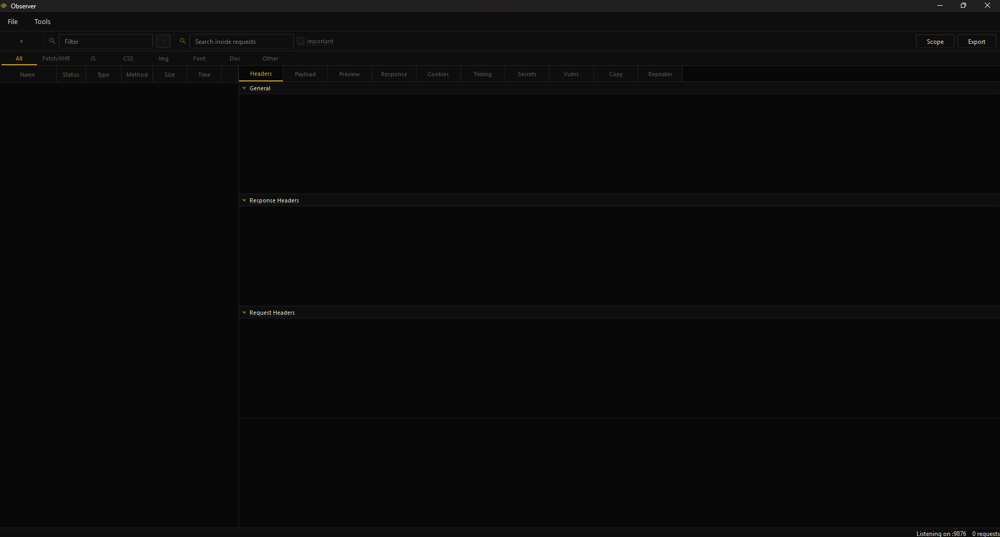

# Observer

**Automated HTTP traffic inspection with real-time vulnerability detection and secret scanning.**

---

## Overview

Observer automates the full workflow of HTTP request inspection — from live traffic capture through automated vulnerability detection to manual penetration testing. It's built for security researchers and API testers who need a lightweight, self-contained alternative to proxy chains.

**How it works:** Point your browser or app at the local capture endpoint, watch requests flood in, and Observer instantly flags vulnerabilities (IDOR, SSRF, XXE), detects exposed secrets (JWTs, API keys), and lets you resend & diff requests for rapid testing.

---

## Core Capabilities

| Mode        | What You Get                                                                   |
| ----------- | ------------------------------------------------------------------------------ |
| **Capture** | Real-time HTTP interception with noise filtering & positive scoping            |
| **Analyze** | Automated vulnerability detection (IDOR, SSRF, open redirect, XXE, SQLi, etc.) |
| **Inspect** | Full request/response breakdown: headers, cookies, payloads, timings           |
| **Test**    | Built-in repeater to modify & resend requests with custom headers/body         |
| **Export**  | Save as JSON/HAR, copy as cURL/Python/fetch(), diff side-by-side               |

---

## Features 

 **Live Request Capture** — Intercept traffic from browser or app; configurable scope & noise filters  
 **Automated Vulnerability Scanning** — IDOR, SSRF, open redirect, XXE, SQL injection, GraphQL, CORS, insecure cookies  
 **Secret Detection** — JWTs, bearer tokens, AWS keys, GitHub/Stripe/Twilio tokens, private keys (with JWT decoding)  
 **Request Repeater** — Edit & resend captured requests; see responses in real-time  
 **Advanced Diff** — Compare two requests side-by-side (headers, body, response)  
 **Multi-Format Export** — JSON, HAR, or copy as cURL / Python requests / fetch()  
 **Persistent Database** — All requests stored locally with notes, stars, and annotations  
 **Security Tagging** — Auto-flags sensitive endpoints (auth, admin, token paths) & headers  
 **Dark UI** — Black & gold professional interface; PyQt6 native, zero external UI libs  

---

## Technical Details

- **Frontend** — PyQt6 native GUI with custom dark theme (QPainter, no CSS/web tech)
- **Backend** — SQLite with WAL mode; thread-safe DB access
- **Detection** — Regex-based patterns for 8+ vulnerability types + credential scanning
- **Capture** — Built-in HTTP endpoint + browser proxy integration
- **Export** — JSON, HAR 1.2 format, code snippets (cURL, Python, fetch)

---

## Use Cases

**API Security Testing** — Identify IDOR, SSRF, authorization flaws in real-time  
**Credential Audits** — Spot exposed tokens, API keys before they leak  
**API Documentation** — Export captured requests for docs or test suites  
**Incident Response** — Capture & analyze suspicious traffic locally  
**Workflow Automation** — Grab request code; drop into CI/CD tests  

---

## Notes

- **Local Only** — Requires browser proxy config or app-level POST integration
- **Pattern-Based** — Vulnerability flags are starting points; manual verification required
- **No MITM** — Doesn't intercept HTTPS by default; set up your own proxy if needed
- **Findings** — Hints are heuristic (e.g., numeric IDs = potential IDOR); not guaranteed exploits

---

## License

Private — authorized security testing and research only.s
